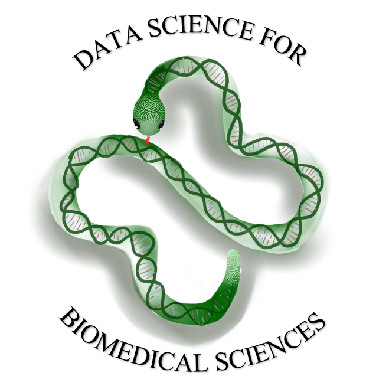
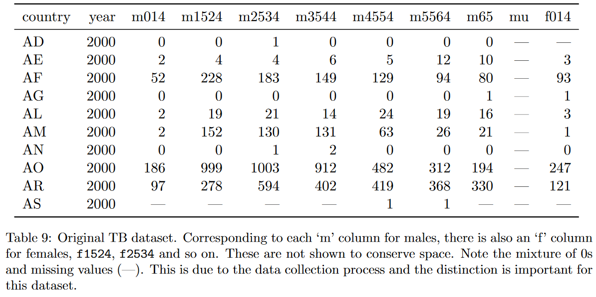
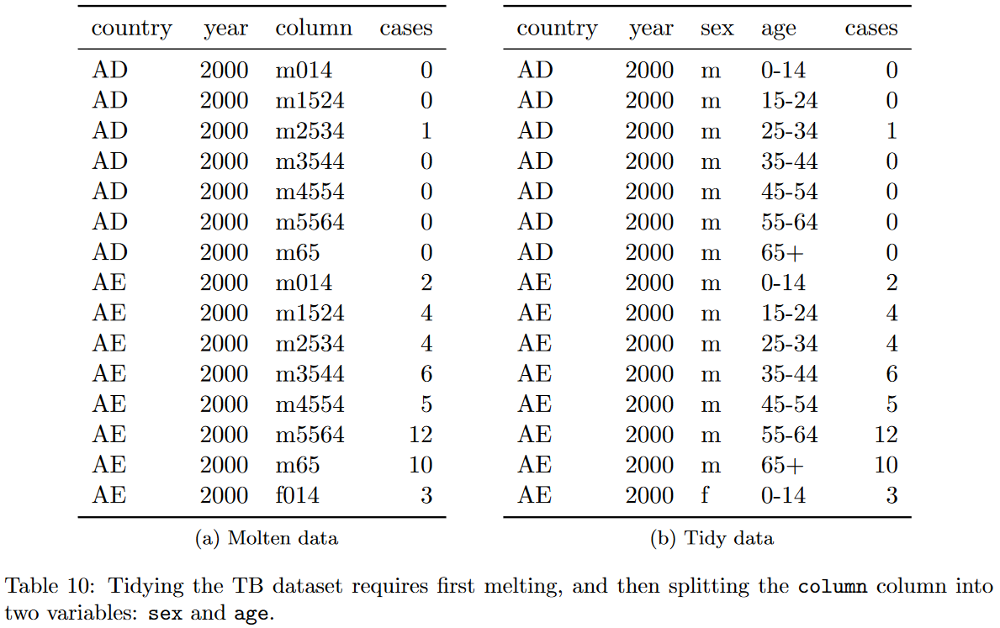

```{r setup, include=FALSE}
options(htmltools.dir.version = FALSE)
knitr::opts_chunk$set(
  fig.width=9, fig.height=3.5, fig.retina=3,
  out.width = "100%",
  cache = FALSE,
  echo = TRUE,
  eval = FALSE,
  message = FALSE, 
  warning = FALSE,
  fig.show = TRUE,
  hiline = TRUE
)

library(reticulate)
reticulate::use_condaenv()

```

```{r xaringan-themer, include=FALSE, warning=FALSE}
library(xaringanthemer)
style_duo_accent(
  primary_color = "#8B1F41",
  secondary_color = "#C64600",
  inverse_header_color = "#FFFFFF",
  link_color = "#2CD5C4"
)
```

## Committee Chair: Anne Brown, PhD

.pull-left[
.center[

]
]

.pull-right[
- Assistant Professor
- Biochemistry and Data Science
- Molecular Modeling & Drug Design
- Applied Data Science & Education
- <a href="https://bevanbrownlab.com">Bevan Brown Lab</a> + <a href="https://www.databridge.dev/">DataBridge</a></p>
]

---

## Rest of the Committee

.row[
.column[
#### Dave Higdon

Statistics<br />
Department Head
]
.column[
#### Alex Hanlon

Statistics<br />
<a href="https://biostat.centers.vt.edu/">CBHDS</a><br />
<a href="https://biostat.centers.vt.edu/">iTHRIV BERD</a>
]
.column[
#### Nikki Lewis

Honors College<br />
Computational Research Grant
]
]

---

## Hello!

.pull-left[
.center[

]

]
.pull-right[
- PhD **Candidate**: Virginia Tech (Winter 2021)
  - Data Science education & pedagogy
  - Medical, Biomedical, Health Sciences
-  Inten at RStudio, 2019
  - [`gradethis`](https://github.com/rstudio-education/gradethis)
  - Code grader for [`learnr`](https://github.com/rstudio/learnr) documents
- The Carpentries
  - Instructor, 2014
  - Trainer, 2020
  - Community Maintainer Lead, 2020
- Workshop Instructor
- [R + Python!](https://rstudio.github.io/reticulate/)

<center>
    
</center>
]

---

## Educational Materials

<div class="row">
  <div class="column">
    <center>
      
    </center>
  </div>
  <div class="column">
    <center>
       <br />
      
      
    </center>
  </div>
  <div class="column">
    <center>
      
      <a href="https://ds4biomed.tech/">ds4biomed.tech</a>
    </center>
  </div>
</div>

---

class: inverse center middle

# Current Data Science Education

---

.pull-left[

]

.pull-right[
- Data Science education is a **commodity**
- Content is **not** an issue
- **Domain experts** can help learners improve **data literacy**

.myfootnote[Kross, S., Peng, R. D., Caffo, B. S., Gooding, I., and Leek, J. T. (2020). The Democratization of Data Science Education. The American Statistician, 74(1), 1–7. https://doi.org/10.1080/00031305.2019.1668849]
]

---

## Why Domain Specificity?

- **Democratization** of data science education enables **more domain specific learning materials**

- You learn better when things are more relevant
- Internal factors for motivation
- Create feedback loops for learning
- Self-directed learners

.myfootnote[
- Koch, C., and Wilson, G. (2016). Software carpentry: Instructor Training. https://doi.org/10.5281/zenodo.57571
- Kross, S., Peng, R. D., Caffo, B. S., Gooding, I., and Leek, J. T. (2020). The Democratization of Data Science Education. The American Statistician, 74(1), 1–7. https://doi.org/10.1080/00031305.2019.1668849
- Wilson, G. (2019). Teaching tech together: How to make your lessons work and build a teaching community around them. CRC Press.
]

---

class: inverse center middle

# Identifying Our Learners

---

## What Do Our Learners Know?


.pull-left[
Concept Maps


Can also use "task deconstruction"
]

.pull-right[
Dreyfus model of skill acquisition


Novice, Competent, Proficient, Expert, Master
]

.myfootnote[
- Dreyfus, S. E., and Dreyfus, H. L. (1980). A five-stage model of the mental activities involved in directed skill acquisition. California Univ Berkeley Operations Research Center.
- Koch, C., and Wilson, G. (2016). Software carpentry: Instructor Training. https://doi.org/10.5281/zenodo.57571
- Wilson, G. (2019). Teaching tech together: How to make your lessons work and build a teaching community around them. CRC Press.
]

---

## Identify Learners: Learner Self-Assessment Survey

- VT IRB-20-537
- Surveys: https://github.com/chendaniely/dissertation-irb/tree/master/irb-20-537-data_science_workshops
  - Currently working on survey validation

- Combination of:
  - **The Carpentries** surveys: https://carpentries.org/assessment/
  - **"How Learning Works: Seven Research-Based Principles for Smart Teaching"** by Susan A. Ambrose, Michael W. Bridges, Michele DiPietro, Marsha C. Lovett, Marie K. Norman
  - **"Teaching Tech Together"** by Greg Wilson

1. Demographics (6)
2. Programs Used in the Past (1)
3. **Programming Experience** (6)
4. **Data Cleaning and Processing Experience** (4)
5. **Project and Data Management** (2)
6. **Statistics** (4)
7. Workshop Framing and Motivation (3)
8. Summary Likert (7)

---

## Cluster Results on 16 Questions

<center>

</center>

---

## The Personas

Clare Clinician, Samir Student, Patricia Programmer, Alex Academic <br />
https://ds4biomed.tech/who-is-this-book-for.html#the-personas


---

<center>

</center>

---

class: inverse center middle

# Plan the Learning Materials

---

## Planning the Learning Materials

Learning objectives:

1. **Name** the features of a tidy/clean dataset
2. **Transform** data for analysis
3. **Identify** when spreadsheets are useful
4. **Assess** when a task should not be done in a spreadsheet software
5. **Break down** data processing into smaller individual (and more manageable) steps
6. **Construct** a plot and table for exploratory data analysis
7. **Build** a data processing pipeline that can be used in multiple programs
8. **Calculate, interpret, and communicate** an appropriate statistical analysis of the data

---

<center>

</center>

.myfootnote[
Anderson, L. W., Bloom, B. S., and others. (2001). A taxonomy for learning, teaching, and assessing: A revision of Bloom’s taxonomy of educational objectives. Longman,.

]

---

class: inverse center middle

# Tidy Data

---

## Data is messy in different ways

<center>

</center>

.myfootnote[
- Allison Horst's Illustrations: https://github.com/allisonhorst/stats-illustrations
]

---

<center>

</center>

.myfootnote[Wickham, H. (2014). Tidy Data. Journal of Statistical Software, 59(1), 1–23. https://doi.org/10.18637/jss.v059.i10
]

---

<center>

</center>

.myfootnote[Wickham, H. (2014). Tidy Data. Journal of Statistical Software, 59(1), 1–23. https://doi.org/10.18637/jss.v059.i10
]

---

## A different view of data

.center[

]

.myfootnote[https://www.garrickadenbuie.com/project/tidyexplain/]

---

## Example Data Science Problem

post_Q5.1: Cytomegalovirus (CMV) is a common virus that normally does not cause any problems in the body.
However, it can be of concern for those who are pregnant or immunocompromised.
Suppose you have the following Cytomegalovirus dataset of CMV reactivation among patients after Allogenetic Hematopoietic Stem Cell Transplant (HSCT) in an Excel sheet (first 10 rows shown below):

<center>

</center>

It is believed that the donor activating KIR genotype is a contributing factor for CMV reactivation after myeloablastive allogenetic HSCT. What variables are associated with CMV reactivation?

.myfootnote[
Data from: Peter Higgins (2021). medicaldata: Data package for Medical Datasets. R
  package version 0.1.0. https://github.com/higgi13425/medicaldata
]

```{r, eval=TRUE, include=FALSE}
library(tidyr)
library(writexl)
cmv_raw <- read.csv("data/cmv.csv")
cmv_sub <- cmv_raw[, c("ID", "age", "prior.radiation", "aKIRs", "cmv", "donor.cmv")]
cmv_wide <- pivot_wider(cmv_sub, -donor.cmv, names_from = donor.cmv, values_from = donor.cmv)
names(cmv_wide) <- c("ID", "age", "prior_radiation", "aKIRs", "cmv", "donor_negative", "donor_positive")
write_xlsx(cmv_wide, "data/cmv.xlsx")
```


---

## Q1

- Load the excel sheet

```{r}
# load library
library(tidyverse)
library(readxl)

# use a library function
# know about paths
# variable assignment
# function arguments
dat <- read_excel("./data/cmv.xlsx")
```


<!--
```{python}
# load a library
# library alias
import pandas as pd

# use a library function
# know about paths
# variable assignment
# function arguments
dat = pd.read_excel("./data/cmv.xlsx")
```
-->

---

## Q2

- Filter the data for individuals over the age of 65

```{r}
# pipes, data filtering, boolean conditions
dat %>%
  filter(age > 65)
```


<!--
```{python}
# data filtering, boolean conditions
dat.loc[dat["age"] > 65]
```
-->

## Q3

- Save filtered dataset as an Excel file to send to a colleague

```{r}
# saving intermediates for data pipelines
subset <- dat %>%
  filter(age > 65)

# using functions/methods
library(writexl)
subset %>%
  write_xlsx("./data/cmv_65.xlsx")
```

<!--
```{python}
# saving intermediates for data pipelines
subset = dat.loc[dat["age"] > 65]

# using functions/methods
subset.to_excel("./data/cmv_65.xlsx")
```
-->

---

## Q4

- Tidy the dataset so we have a donor CMV status and a patient CMV status in separate columns

.pull-left[
Dirty
<center>

</center>
]
.pull-right[
Tidy
<center>

</center>
]

```{r}
# lists/vectors/selecting
# tidy data and recognize a melt/pivot_longer operation
# keyword arguments
tidy_dat <- dat %>%
  pivot_longer(starts_with("donor"), names_to = "donor_status", values_to = "recipient_status") %>%
  drop_na()
```


<!--
```{python}
# lists
# tidy data and recognize a melt operation
# keyword arguments
tidy = dat.melt(id_vars=["ID", "age", "prior_radiation", "aKIRs", "cmv"],
                value_name="donor_cmv")
tidy = tidy.dropna()
```
-->

---

## Q5

- Plot a histogram of the age distribution of our data

```{r}
library(ggplot2)

# plotting syntax
# layering
ggplot(tidy_dat, aes(x = age)) +
  geom_histogram()
```


<!--
```{python, eval=FALSE}
import seaborn as sns
import matplotlib.pyplot as plt

# Plotting values
sns.histplot(tidy, x="age")
plt.show()
```
-->

---

## Q6

- Fit a model (e.g., logistic regression) to see which variables are associated with patient CMV reactivation.

```{r}
# formula syntax
model <- glm(cmv ~ age + prior_radiation + aKIRs + donor_status,
             data = tidy_dat, family = "binomial")

# look at model results
summary(model)

# dataframe of coefficients
library(broom)
tidy(model)

# Logistic regression is interpreted via odds ratios
tidy(model) %>%
  mutate(or = exp(estimate))
```


<!--
```{python, eval=FALSE}
import statsmodels.api as sm
import statsmodels.formula.api as smf

# Predictor/Response variables
# Dummy Variables (aka one-hot encoding)
# Correct model for question at hand
# How to read and interpret the output
model = smf.glm("cmv ~ age + prior_radiation + aKIRs + donor_cmv",
                data=tidy,
                family=sm.families.Binomial())
result = model.fit()
result.summary()
```
-->

---

class: inverse center middle

# Data Science is Different From Computer Science

---

## Canterbury QuestionBank

Suppose you try to perform a binary search on a 5-element array sorted in the reverse order of what the binary search algorithm expects.
How many of the items in this array will be found if they are searched for?

- A. 5
- B. 0
- **C. 1**
- D. 2
- E. 3

Explanation: C: Only the middle element will be found.
The remaining elements will not be contained in the subranges that we narrow our search to.

Software engineering, with some ventures into software architecture and computing education: https://neverworkintheory.org/

---

## Adapt From Computer Science Education

“DataFrame” objects are not standard computer science data structures

---

## Existing Data Science Book TOC: R + JS + Stats

.row[
.column[
__R for Data Science__
1. Welcome Introduction
1. Explore Introduction
1. Data visualisation
1. Workflow: basics
1. Data transformation
1. Workflow: scripts
1. Exploratory Data Analysis
1. Workflow: projects
1. Wrangle Introduction
1. Tibbles
1. Data import
1. **Tidy data**

...

Ch 21. iteration
]

.column[
__Data Science for JavaScript__
1. Introduction
1. Basic Features
1. Callbacks
1. Objects and Classes
1. HTML and CSS
1. Manipulating Pages
1. Dynamic Pages
1. Visualizing Data
1. Promises
1. Interactive Sites
1. **Managing Data**
1. Creating a Server
1. Testing
1. **Using Data-Forge**
1. Capstone Project
]

.column[
__OpenIntro Statistics__
1. **Introduction to Data**
2. Summarizing data
3. Probability
4. Distributions of random variables
5. Foundations of inference
6. Inference for categorical data
7. Inference for numerical data
8. Introduction to linear regression
9. Multiple and logistic regression
]
]

---

## Existing Data Science Book TOC: Python

.pull-left[
__Python for Data Analysis__
1. Preliminaries
1. Introductory Examples
1. IPython: An Interactive Computing and Development Environment
1. NumPy Basics: Arrays and Vectorized Computation
1. Getting Started with pandas
1. Data Loading, Storage, and File Formats
1. **Data Wrangling: Clean, Transform, Merge, Reshape**
8. Plotting and Visualization
9. Data Aggregation and Group Operations
10. Time Series
11. Financial and Economic Data Applications
12. Advanced NumPy

Appendix: Python Language Essentials
]

.pull-right[
__Learning the Pandas Library__
1. Introduction
1. Installation
1. Data Structures
1. Series
1. Series CRUD
1. Series Indexing
1. Series Methods
1. Series Plotting
1. Another Series Example
1. DataFrames
1. Data Frame Example
1. Data Frame Methods
1. Data Frame Statistics
1. **Grouping, Pivoting, and Reshaping**
1. Dealing With Missing Data
1. Joining Data Frames
1. Avalanche Analysis and Plotting
1. Summary
]

---

## Existing Data Science Book TOC: My Own Work

.row[
.column[
__Pandas for Everyone__
1. Pandas DataFrame Basics
1. Pandas Data Structures
1. Introduction to Plotting
1. Data Assembly
1. Missing Data
1. **Tidy Data**
7. Data Types
8. Strings and Text Data
9. Apply
10. Groupby Operations: Split–Apply–Combine
11. The datetime Data Type
12. Linear Models
13. Generalized Linear Models
14. Model Diagnostics
15. Regularization
16. Clustering
17. Life Outside of Pandas
18. Toward a Self-Directed Learner

Appendix: Python Language Essentials
]
.column[
__ds4biomed__
1. Introduction
1. Spreadsheets
1. R + RStudio
1. Load Data
1. Descriptive Calculations
1. **Clean Data (Tidy)**
7. Visualization (Intro)
8. Analysis (Intro)
9. Additional Resources
]
.column[
__Conference Workshop__
1. Introduction
2. **Tidy Data**
3. Functions
4. Plotting/Modeling
]
]

---

## Create Your Own Learner Personas

If you do end up teaching a domain specific group (e.g., biomedical sciences)

1. Identify who your learners are
2. Figure out what they need and want to know
3. Plan a guided learning tract

- Use the surveys I've compiled.

https://github.com/chendaniely/dissertation-irb/tree/master/irb-20-537-data_science_workshops

### What's Next?

- Survey Validation (Factor Analysis)
- Learner pre/post workshop "confidence"
- Long-term survey for confidence + retention (summative assessment)
- Different types of formative assessment questions

---

## Additional Resources

- Data Organization in Spreadsheets, Karl W. Broman & Kara H. Woo
  - https://www.tandfonline.com/doi/full/10.1080/00031305.2017.1375989
- Examples of other learner personas
  - Rstudio Learner Personas: https://rstudio-education.github.io/learner-personas/
  - The Carpentries Learner Profiles: https://software-carpentry.org/audience/
- Creating your own personas
  - Zagallo, Patricia, Jill McCourt, Robert Idsardi, Michelle K Smith, Mark Urban-Lurain, Tessa C Andrews, Kevin Haudek, et al. 2019. “Through the Eyes of Faculty: Using Personas as a Tool for Learner-Centered Professional Development.” CBE—Life Sciences Education 18 (4): ar62.
- Bloom's Taxonomy
  - Bloom's Taxonomy Verb Chart: https://tips.uark.edu/blooms-taxonomy-verb-chart/
- Teach like a Champion
  - Version 2.0's 62 Techniques: https://teachlikeachampion.com/wp-content/uploads/Teach-Like-a-Champion-2.0-Placemat-with-the-Nanango-Nine.pdf

---
class: center, middle

# Thanks!

Slides: https://speakerdeck.com/chendaniely/learner-personas-for-domain-specific-data-science-educational-materials-f74fb027-fafb-4da6-ac24-f303c38ad876

Repo: https://github.com/chendaniely/

Prelims: https://chendaniely.github.io/dissertation-prelim
